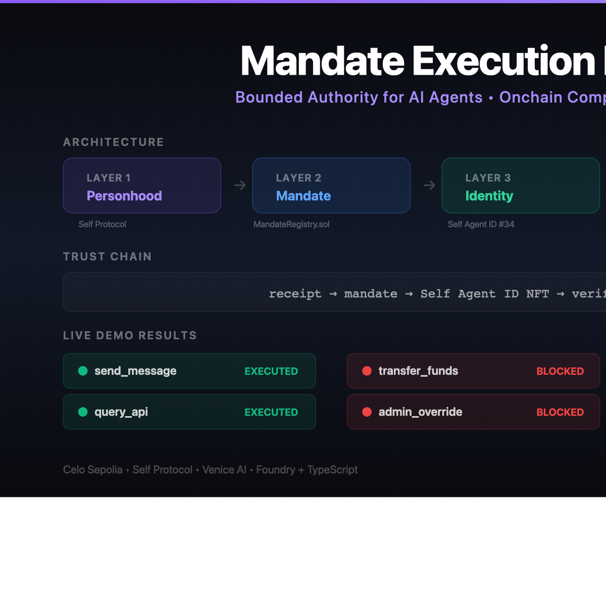

<p align="center">
  
</p>

<p align="center">
  <strong>The missing primitive between identity and autonomy.</strong><br/>
  <em>Humans define boundaries. Agents execute within them. Anyone can verify — onchain.</em>
</p>

<p align="center">
  
  
  
  
  
</p>

---



> 7 onchain transactions. 5 queryable receipts. 2 blocked out-of-scope actions. 1 blocked post-revocation attempt. Every action traced back to a verified human — no trust required.

## What It Is

A primitive that lets humans define **bounded authority** for AI agents, agents execute within it, and **anyone verify compliance** — without trusting the agent's word.

The real primitive is not "verified identity." It's a **verified agent acting within a bounded mandate**, with every action receipted onchain.

## The Problem

Personhood verification is layer 1 — partially solved. The missing layer is **action legitimacy**: proving that a verified agent acted within the scope its human authorized, at the action level, with onchain proof.

## How It Works

```
human proves identity (Self Protocol ZK passport)
  → human defines mandate (allowed actions, scope, time window)
  → mandate encoded onchain + selfProofHash + MetaMask delegation
  → agent gets identity bound to that mandate
  → before every action: compliance engine checks if action is in-mandate
  → if compliant: execute + post onchain receipt
  → if out-of-mandate: block + post onchain receipt
  → anyone can verify: "verified human authorized this, action was within mandate"
```

## Architecture — Five Layers

```
┌──────────────────────────────────────────────────┐
│  PERSONHOOD LAYER  → Self Protocol (ZK passport) │
│  MANDATE LAYER     → MandateRegistry.sol         │
│  IDENTITY LAYER    → ERC-8004 agent identity     │
│  REASONING LAYER   → Venice AI (private)         │
│  RECEIPT LAYER     → ActionReceipt.sol           │
└──────────────────────────────────────────────────┘
```

Each layer is **load-bearing**:
- **Self Protocol** — proves the mandate creator is a real human, not a bot farm
- **MandateRegistry** — onchain state: what actions are allowed, expiry, value limits
- **ERC-8004** — agent has a verifiable onchain identity
- **Venice AI** — private compliance reasoning (no data retention)
- **ActionReceipt** — immutable proof of every action, queryable by anyone

## Trust Chain

```
receipt → mandate → Self proof → verified human
```

Every receipt references a mandate. Every mandate contains a `selfProofHash`. The hash proves a verified human authorized the mandate. The chain is fully traceable onchain.

## Deployed Contracts (Base Sepolia)

| Contract | Address |
|---|---|
| MandateRegistry | `0xA0F8E21B7DeafB489563B5428e42d26745c9EA52` |
| ActionReceipt | `0xEcAe9d43d49d02D1ED926A7Dce25e85a9B047a43` |

**Chain:** Base Sepolia (84532)

## Addresses

| Role | Address |
|---|---|
| Human (mandate creator) | `0xf282FCCc0608147aB493e6a081d354646614b4F1` |
| Agent (executor) | `0x2d8E271E22A26508817561f12eff0874dD0aA6DA` |

## Live Proof — Verify It Yourself (Mandate #10)

> **Every claim below is verifiable onchain. Click any link.**

### Mandate Lifecycle

| Step | Tx |
|------|----|
| Mandate Created | [0x3c8efa6f...5828](https://sepolia.basescan.org/tx/0x3c8efa6f8aa1f8770bc86ee68b0aeffa00fa25a9f0c65246e8d6690afc2b5828) |
| Mandate Revoked | [0x90c02562...7094](https://sepolia.basescan.org/tx/0x90c02562edb9f43cd960f13536a781a94665ec3489ae5bf4699fd1e0c7ff7094) |

### Action Receipts

| # | Action | Context | Result | Tx |
|---|--------|---------|--------|----|
| 1 | `send_message` | In mandate | ✅ EXECUTED | [0x682e35f3...719c](https://sepolia.basescan.org/tx/0x682e35f3f479ead34de867098afc0781855efaae3959e5aae53dd32a3d28719c) |
| 2 | `transfer_funds` | Not in allowed actions | 🛑 BLOCKED | [0x6283bd9f...64ae](https://sepolia.basescan.org/tx/0x6283bd9f49caff70890c44edfd44b7df0ccd935a9d3b8097422f67cda56264ae) |
| 3 | `query_api` | In mandate | ✅ EXECUTED | [0xd62eede3...b53](https://sepolia.basescan.org/tx/0xd62eede386b5f538a125adfdeee2a0aa05f9fd43c2ca8ce86cd2c1ae82bbba53) |
| 4 | `admin_override` | Not in allowed actions | 🛑 BLOCKED | [0x89e22500...02c2](https://sepolia.basescan.org/tx/0x89e2250032f11b6c484e8634a63d093dc093998cb07329cd64d0633d77fa02c2) |
| 5 | `send_message` | After revocation | 🛑 BLOCKED | [0xa66d43ee...7682](https://sepolia.basescan.org/tx/0xa66d43eecd4130ca60cfb9d0c29058d8eb17c876d878859f27cd7bb240417682) |

**7 onchain transactions. 5 receipts queryable via `ActionReceipt.getReceipts(10)`. Zero trust required.**

## Run the Demo

```bash
cd agent
cp .env.example .env
# Fill in your keys

npm install
npx tsx demo-run.ts
```

### Environment Variables

```
VENICE_API_KEY=           # venice.ai/settings/api
AGENT_PRIVATE_KEY=        # agent wallet private key
HUMAN_PRIVATE_KEY=        # human wallet private key
BASE_SEPOLIA_RPC_URL=     # Base Sepolia RPC
MANDATE_REGISTRY_ADDRESS= # deployed registry
ACTION_RECEIPT_ADDRESS=   # deployed receipt contract
```

<details>
<summary><strong>Smart Contracts</strong> (click to expand)</summary>

### MandateRegistry.sol

Human creates a mandate defining what the agent can do:

```solidity
struct Mandate {
    address owner;              // human
    address agent;              // agent address
    bytes32[] allowedActions;   // keccak256 of action type strings
    uint256 expiresAt;
    uint256 maxValuePerAction;
    bytes32 selfProofHash;      // hash of Self ZK proof
    bool active;
}
```

Key functions:
- `createMandate()` — human defines bounded authority
- `isHumanBacked()` — checks selfProofHash != 0
- `isActionAllowed()` — checks action hash against mandate
- `isMandateActive()` — checks expiry + active flag
- `revokeMandate()` — human can kill the mandate

### ActionReceipt.sol

Immutable proof of every action:

```solidity
struct Receipt {
    uint256 mandateId;
    bytes32 actionHash;
    bytes32 reasoningHash;   // hash of reasoning (privacy-preserving)
    bool compliant;          // true = executed, false = blocked
    uint256 timestamp;
    bytes agentSignature;
}
```

</details>

<details>
<summary><strong>Why Venice AI? Two-Layer Compliance</strong> (click to expand)</summary>

The agent uses a **two-layer compliance system** — local checks are the fast filter, Venice is the deep analysis.

**Local checks** (`mandate.ts`) are simple — compare action hashes, check expiry, check value limits. They catch obvious violations instantly.

**Venice AI** handles what local checks can't — semantic reasoning over intent, context, and edge cases:

| Scenario | Local Check | Venice |
|---|---|---|
| "agent can send messages but NOT to competitors" | Can't check — doesn't know who competitors are | Understands semantic context |
| "agent can query APIs but only for market data, not personal data" | Can't distinguish — both are `query_api` | Reasons over params |
| "agent can spend up to $10 but only on business expenses" | Can check amount, can't judge "business expense" | Understands intent |
| "agent can trade but not during earnings blackout periods" | Needs external knowledge | Can reason about timing context |

**Why privacy matters:** Mandate contents are sensitive. "My agent can spend $50k on these 3 vendors" — you don't want that public. Venice has **no data retention**, so mandate details stay private. Only the **hash** of the reasoning goes onchain — verifiable without exposing contents.

```
Local checks (fast, free, deterministic)
  → catches obvious violations (wrong action type, expired, revoked)

Venice (private, semantic, probabilistic)
  → catches subtle violations that need reasoning
  → reasoning hash goes onchain for verifiability
  → mandate contents never exposed publicly
```

Both layers are needed for a production-grade primitive.

</details>

## Sponsor Integration

> Each sponsor is **load-bearing** — remove any one and the system breaks.

| Sponsor | Role | What Breaks Without It |
|---------|------|----------------------|
| **Self Protocol** | Personhood (ZK passport) | Bot farms flood mandate creation |
| **MetaMask** | ERC-7715 Delegation | No cryptographic proof human authorized agent |
| **Venice AI** | Private Reasoning | Mandate contents exposed publicly |
| **Protocol Labs** | ERC-8004 Identity | Agent has no verifiable onchain identity |

## MCP Server — Agent Integration Layer

The MEL MCP server lets any agent framework (Purple Hermes, Claude Code, etc.) operate under mandate governance via the Model Context Protocol.

### Tools Exposed

| Tool | Description |
|---|---|
| `check_compliance` | Dry-run: is this action allowed? (no onchain cost) |
| `execute_action` | Full pipeline: check + execute + onchain receipt |
| `get_mandate` | Read mandate state from chain |
| `get_receipts` | Read all action receipts for a mandate |
| `get_logs` | Read local execution log |

### Quick Start

```bash
cd agent
npm run mcp    # starts MCP server on stdio
```

### Config for Agent Frameworks

```json
{
  "mcpServers": {
    "mel-mandate": {
      "command": "npx",
      "args": ["tsx", "mcp-server.ts"],
      "cwd": "/path/to/MandateExecutionLayer/agent"
    }
  }
}
```

### Integration Flow

```
Agent (e.g. Purple Hermes) wants to execute an action
  → calls check_compliance(mandateId, "send_message")
  → MEL checks: delegation valid? mandate active? action allowed? Venice says OK?
  → returns { compliant: true/false, reason: "...", confidence: 0.95 }
  → if compliant: agent proceeds, calls execute_action for onchain receipt
  → if blocked: agent skips action, receipt posted showing block
```

This makes MEL a **pluggable governance layer** for any agent — not just the demo agent.

## Tech Stack

- **Solidity** + Foundry — smart contracts
- **TypeScript** — agent runtime
- **Viem** — onchain interactions
- **Venice AI** — private compliance reasoning
- **MetaMask Delegation Toolkit** — ERC-7715 delegations
- **Self Protocol** — ZK passport verification
- **Base Sepolia** — contract deployment

## Project Structure

```
├── contracts/
│   ├── src/
│   │   ├── MandateRegistry.sol
│   │   └── ActionReceipt.sol
│   ├── test/
│   │   ├── MandateRegistry.t.sol
│   │   └── ActionReceipt.t.sol
│   └── script/
│       └── Deploy.s.sol
├── agent/
│   ├── src/
│   │   ├── config.ts          # env, clients, ABIs
│   │   ├── mandate.ts         # fetch + local checks
│   │   ├── venice.ts          # Venice compliance checker
│   │   ├── receipt.ts         # onchain receipt posting
│   │   ├── executor.ts        # action execution
│   │   ├── delegation.ts      # MetaMask delegation
│   │   ├── self.ts            # Self Protocol verification
│   │   ├── logger.ts          # structured logging
│   │   └── index.ts           # core agent loop
│   ├── demo-run.ts            # end-to-end demo
│   ├── mcp-server.ts          # MCP server for agent integration
│   ├── mcp-config.json        # MCP config template
│   ├── agent.json             # ERC-8004 manifest
│   └── agent_log.json         # execution trace
├── THESIS.md                  # visual one-pager
├── EXPLAINER.md               # non-technical pitch
├── IDEAS.md                   # ideation journey + architecture
├── processflow.md             # 5-layer system flow
└── README.md
```

## Verification Guide (for AI judge)

**Latest mandate: #10** (Base Sepolia, created March 20 2026)

1. Read `agent.json` → understand agent capabilities and contracts
2. Read `agent_log.json` → see structured execution trace with tx hashes
3. Query `MandateRegistry.getMandate(10)` → verify mandate structure onchain
4. Query `MandateRegistry.isHumanBacked(10)` → verify Self proof exists
5. Query `ActionReceipt.getReceipts(10)` → verify all 5 receipts onchain
6. Confirm: compliant actions executed (2), out-of-mandate actions blocked (3)
7. Trace: receipt → mandate → selfProofHash → verified human

**Bounty alignment:** Protocol Labs (ERC-8004 + Receipts), Venice (Private Reasoning), MetaMask (ERC-7715 Delegations), Self (ZK Identity), Synthesis Open Track (Agents That Trust + Pay + Cooperate)
